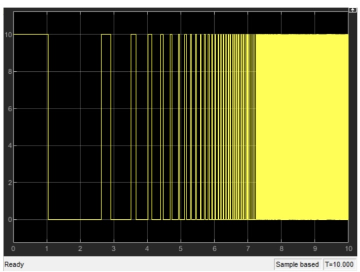

# House_Temperature_Control
The goal is to control the temperature in a house, having the indoor and outdoor temperature, and the heat generated in the house.

<h3> &nbsp;Design of the driver of a heater</h3>

I used an **LM358 IC** along with a **TIP41 transistor**, and a 10 volts **power supply** where by changing the input voltage from 0 to 8 voltes, the output power of the heater changes from 0 to 100 percent.

Transfer function of the heater driver:

$Gd(s) = \frac{Vout(s)}{Vin(s)}\$

<h3> &nbsp;The open-loop controller</h3>

The top level open-loop controller that should be implemented is as follows:

By using the transfer functions above, I implemented the open-loop controller as below in Simulink:

The outputs of the temperature of the house, and Gs are shown below:

Output of the house:

Output of Gs:

<h3> &nbsp;The closed-loop controller</h3>

I implemented a closed-loop PI controller as below, which will make the temperature of the house stable on 26 centigrades in less than 40 seconds: 

The output:

The implementation of the PI controller using operational amplifiers:

I tested the designed circuit for 3 different values of Tout: 2, 10, and 15.

The circuit implementation is as below:

Output corresponding to the temprature of the house:

Output of the controller:

Output corresponding to Gsc:

<h3> &nbsp;The on/off controller</h3>The on/off controller

Consider the open-loop system below, where a relay is used instead of the driver of the heater.

The closed-loop circuit above with the relay in Simulink:

Output corresponding to the temprature of the house:

Output of the controller(relay):

Output corresponding to Gsc, along with the input source:

Implementation of a controller which keeps the temperature of the house between 24 to 28 degrees.

The closed-loop circuit in Simulink:

Output corresponding to the temprature of the house:

Output of the controller(relay):

Output corresponding to Gsc, along with the input source:

Now testign the designed circuit for 3 different values of Tout: 2, 10, and 15.

The circuit implementation is as below:

Output corresponding to the temprature of the house:

Output of the controller:

Output corresponding to Gsc:

As we can see from the results, the outputs of the house and the controller are without change, and the changes in the out put of the sensor can be ignored since the controller is closed-loop. 
